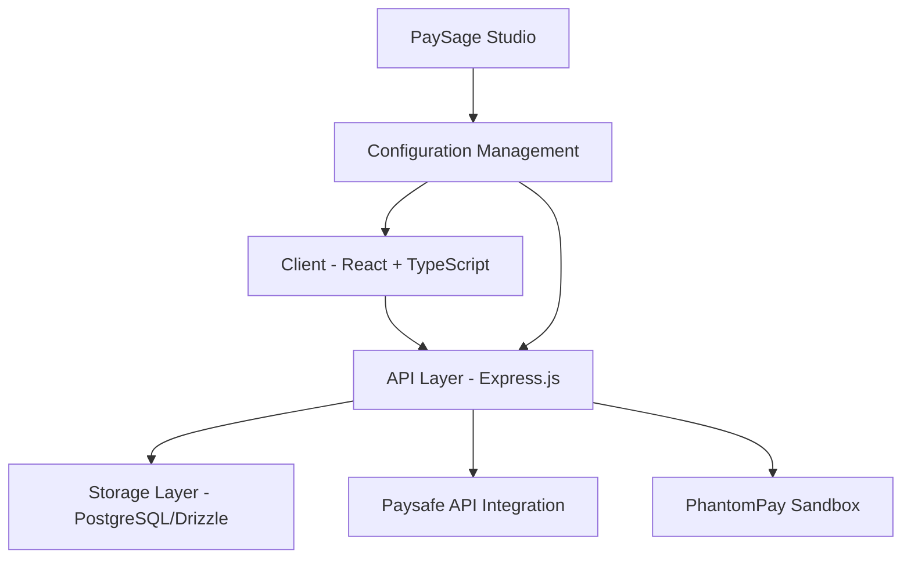
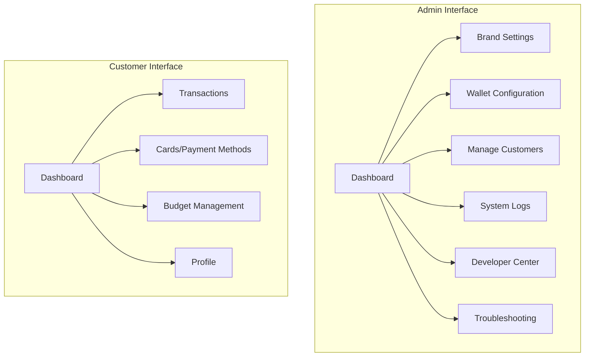
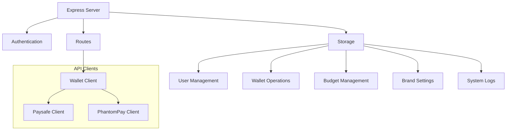
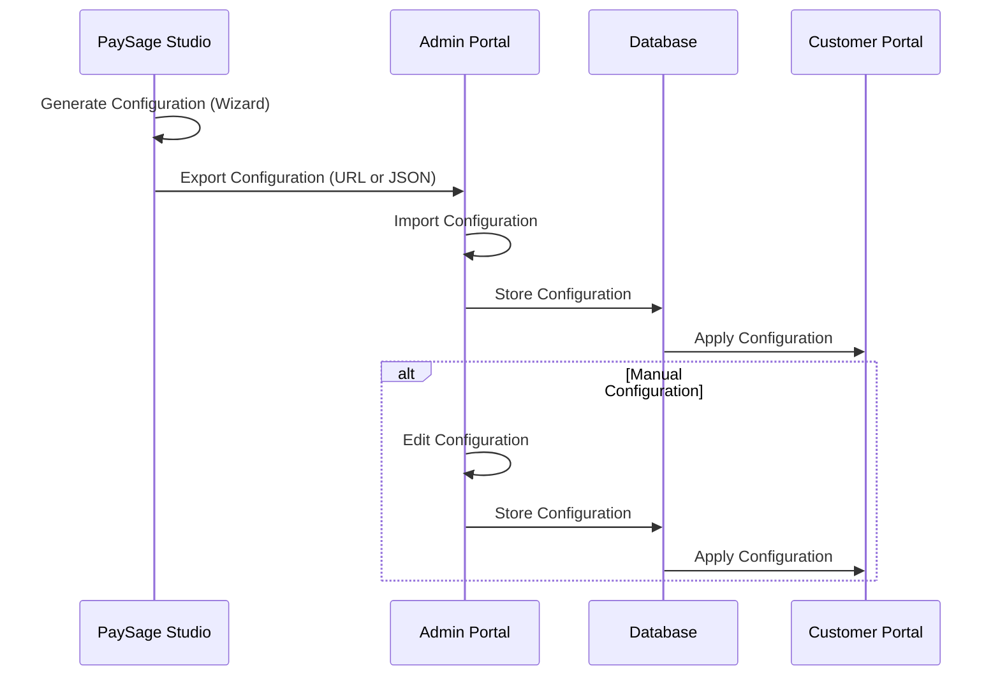
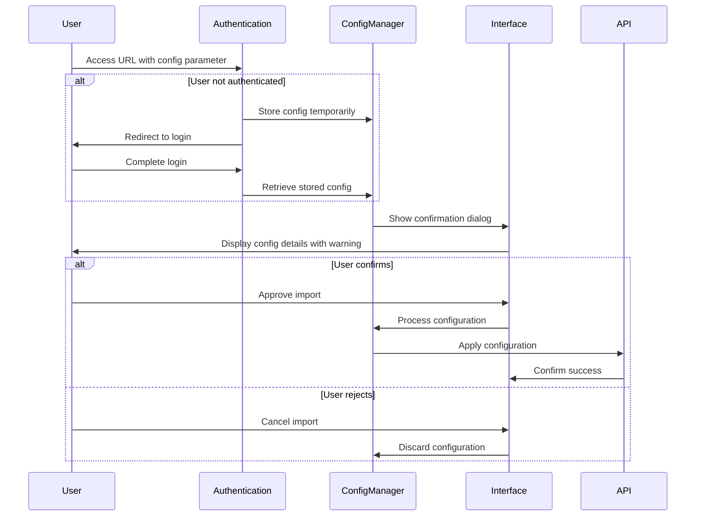
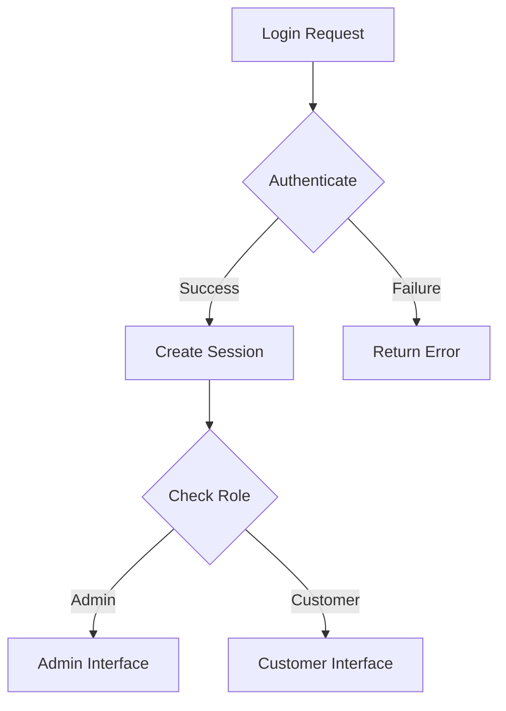
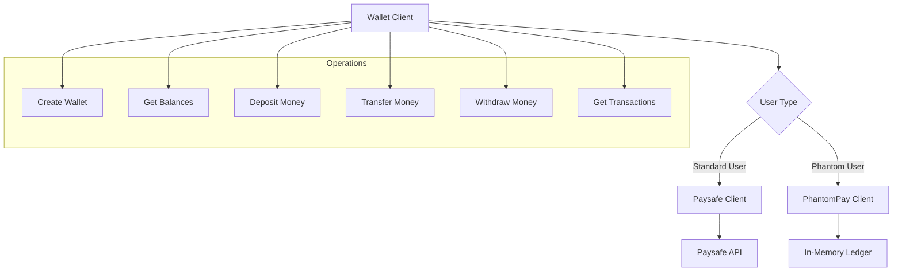
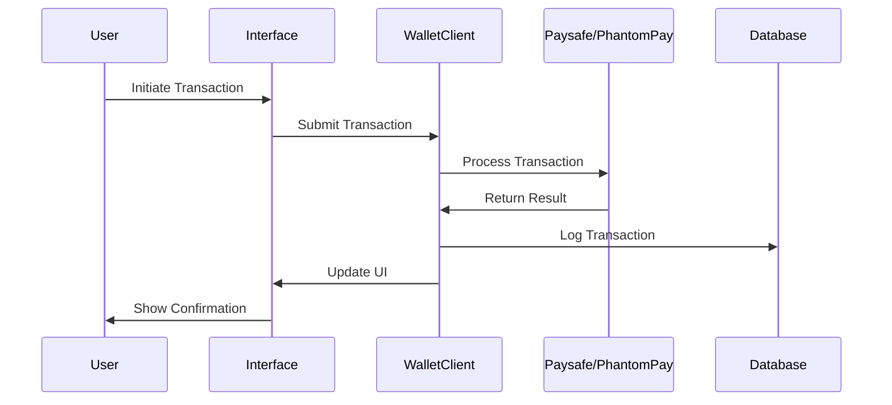
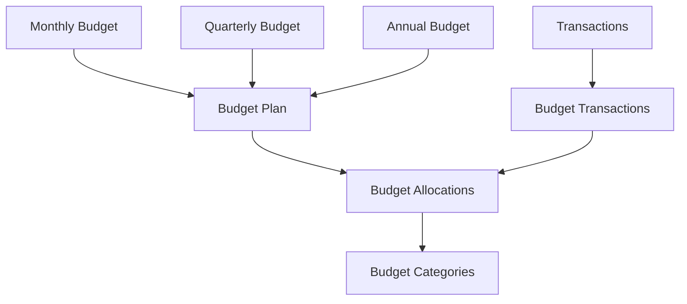
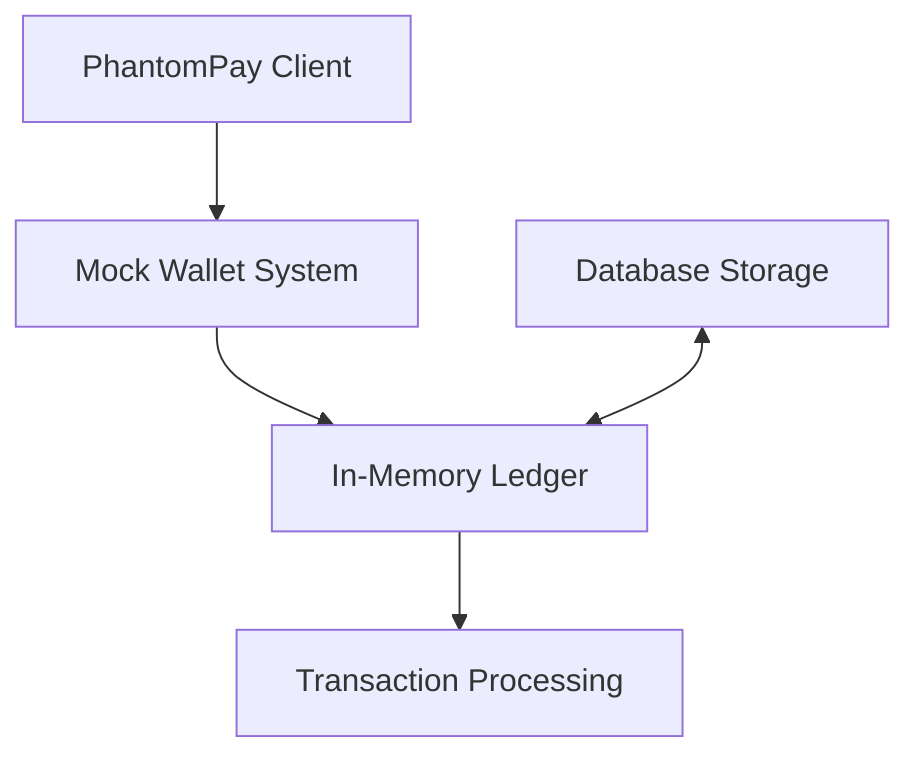

# PaySage Wallet Platform

## Table of Contents
- [Overview](#overview)
- [Architecture](#architecture)
- [Key Components](#key-components)
- [Configuration Management](#configuration-management)
- [Authentication System](#authentication-system)
- [Wallet Operations](#wallet-operations)
- [Budget Management](#budget-management)
- [Admin Controls](#admin-controls)
- [PhantomPay Sandbox](#phantompay-sandbox)
- [Development and Testing](#development-and-testing)
- [API Integration](#api-integration)
- [Getting Started](#getting-started)

## Overview

PaySage Wallet is a white-label digital embedded wallet platform that provides comprehensive configuration and branding capabilities for financial institutions. The platform allows organizations to create custom-branded digital wallets with features like deposits, transfers, withdrawals, budget tracking, and robust analytics.

The system is designed with configurability at its core, enabling organizations to activate only the features they need and customize the entire experience to match their brand identity.

## Architecture

The PaySage Wallet platform uses a modern, full-stack TypeScript architecture with React for the frontend and Express.js for the backend. PostgreSQL with Drizzle ORM handles data persistence.



### Technical Stack

- **Frontend**: React, TypeScript, TailwindCSS, shadcn/ui components
- **State Management**: TanStack Query (React Query)
- **Routing**: Wouter for lightweight routing
- **Backend**: Express.js, TypeScript
- **Database**: PostgreSQL with Drizzle ORM and Drizzle-Zod for validation
- **Authentication**: Passport.js with session-based auth
- **API Integration**: Paysafe Digital Wallets API and PhantomPay Sandbox

## Key Components

### Client Application

The client application is divided into two distinct interfaces:

1. **Admin Interface**: For platform administrators to manage wallet configuration, branding, users, and system settings
2. **Customer Interface**: For end-users to manage their wallets, perform transactions, track budgets, and manage payment methods



### Server Components

The server handles authentication, data persistence, and API integrations:



## Configuration Management

The PaySage Wallet platform features a powerful configuration management system that allows organizations to customize every aspect of the wallet experience. 

### Configuration Schema

The configuration is stored in the `walletConfig` field of the `brandSettings` table and includes:

```typescript
{
  transactionDisplayCount: number;
  allowedCurrencies: string[];
  maxNegativeBalance: number;
  enableAnalytics: boolean;
  enableBulkTransfers: boolean;
  enableTestCards: boolean;
  maxTestCards: number;
  maxTransferAmount: number;
  defaultCommissionRate: number;
  retentionPeriodDays: number;
}
```

### Configuration Flow



### PaySage Studio Integration

PaySage Studio is an external configuration tool that provides a wizard-based interface for generating wallet configurations. The Studio allows non-technical users to create configurations through a step-by-step process.

The integration works as follows:

1. Studio generates a configuration in JSON format
2. Configuration is shared via:
   - Base64-encoded URL parameters
   - Downloadable JSON file
3. Admin imports the configuration through:
   - URL parameter (with security confirmation)
   - File upload interface

### Configuration Import Security

When importing configuration via URL parameters, the system implements several security measures:

1. **Parameter Persistence**: URL parameters are preserved during login/redirect flows
2. **Confirmation Dialog**: Users must explicitly approve configuration imports with a preview of the configuration data
3. **Security Warning**: Users are warned about importing configurations from untrusted sources
4. **Validation**: Configurations are validated before application to prevent invalid or malicious data



### Configuration Export

The platform allows admins to export configurations in two formats:

1. **Shareable URL**: A URL containing the base64-encoded configuration that can be shared with other instances
2. **JSON File**: A downloadable JSON file containing the complete configuration

## Authentication System

PaySage Wallet uses a secure session-based authentication system with Passport.js. The system supports both admin and customer user types with separate interfaces and permissions.



Security features include:

- Password hashing with scrypt
- Timing-safe password comparison
- Session-based authentication
- Protected routes for authenticated users and admin-only features

## Wallet Operations

The wallet system supports multiple operations through both the Paysafe API and the PhantomPay Sandbox.

### Wallet Client Architecture



### Transaction Flow



## Budget Management

The budget system allows users to create budget plans, allocate funds to different categories, and track their spending against these budgets.



### Budget Visualization

The budget visualization uses advanced D3.js-based sunburst charts to provide interactive visual representation of:

1. Budget allocations across categories
2. Spending patterns
3. Budget utilization

## Admin Controls

The admin interface provides comprehensive controls for platform management:

1. **Brand Settings**: Configure brand name, tagline, logo, and icon
2. **Wallet Configuration**: Set transaction limits, allowed currencies, and feature flags
3. **Customer Management**: Create, view, and manage customer accounts
4. **System Logs**: Track system activity and API calls
5. **Developer Center**: Testing tools and API diagnostics
6. **Troubleshooting**: Guided diagnostics for error resolution

## PhantomPay Sandbox

The PhantomPay Sandbox is a mock payment system that mimics the Paysafe API but uses a local database for testing and development.



The sandbox provides:

1. Realistic API responses that match Paysafe
2. Persistent storage for testing continuity
3. Configurable error conditions for testing
4. Per-user activation to allow mixed testing environments

## Development and Testing

### Error Tracking

The platform implements comprehensive error tracking with:

1. Detailed system logs
2. API call recording with cURL equivalents
3. Guided troubleshooting
4. Diagnostic tools in the admin interface

### Test Cards

The system supports test cards for payment method testing:

1. Admin-configurable maximum number of test cards
2. Card network categorization
3. Automatic card number validation
4. Default to user's name in card holder field

## API Integration

### Paysafe Digital Wallets API

The platform integrates with the Paysafe Digital Wallets API (baseURL: https://sandbox.paysafe.com/digitalwallets/) to provide:

1. Real wallet creation and management
2. KYC session management
3. Account restrictions
4. Transaction processing

### External Configuration API

The platform can consume configuration from external sources via:

1. URL parameters (base64-encoded)
2. JSON file upload
3. Direct API configuration

## Getting Started

### Prerequisites
- Node.js 16+
- PostgreSQL database
- Paysafe API credentials (optional for production use)

### Installation
1. Clone the repository
2. Run `npm install` to install dependencies
3. Configure environment variables
4. Run database migrations with `npm run db:push`
5. Start the development server with `npm run dev`

### Admin Login
- Username: wlw_admin
- Password: 6528D232-3F93-4A8D-B5B1-6FD37411C971

### API Keys
For production use, configure the following API keys:
- `PAYSAFE_API_KEY`: Your Paysafe API key
- `PAYSAFE_CLIENT_ID`: Your Paysafe client ID
- `PAYSAFE_CLIENT_SECRET`: Your Paysafe client secret

## License
Proprietary - All rights reserved.